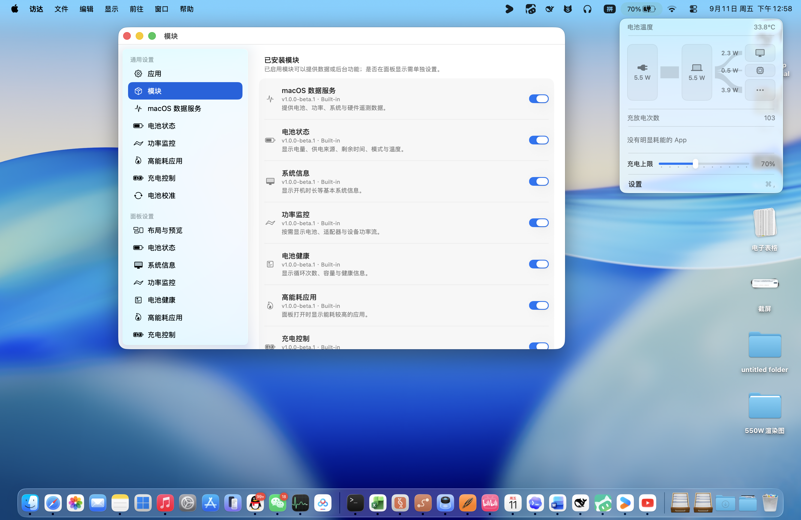
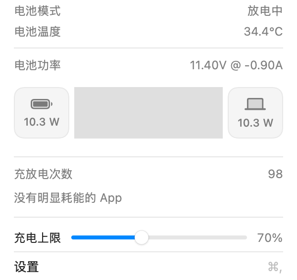
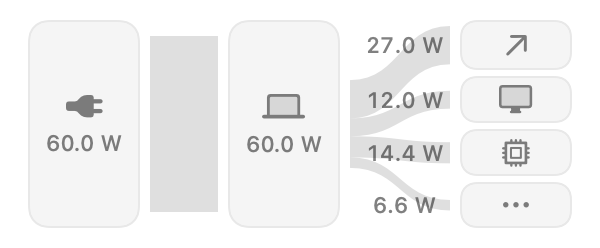

# state

一款遵循 macOS 原生设计的菜单栏电池监控与充电控制工具。它可以显示实时功率、温度、电池健康度与充放电状态，也能直接调整充电上限。

> 当前为 **state 1.0 Beta**，面向 Apple Silicon 的模块化 macOS 菜单栏应用。



## 界面展示

state 使用 macOS 原生控件和统一的圆角功率流布局。展示图同步自当前 1.0 Beta 设计资源：

<table>
  <tr>
    <td></td>
    <td></td>
  </tr>
  <tr>
    <td align="center">电池与充电控制</td>
    <td align="center">二级/三级功率分布</td>
  </tr>
</table>

更多界面方案和状态示例见 [`Design`](Design)；模块设置、安装和开发说明见 [`docs/modules`](docs/modules/README.md)。

图标模型和渲染源文件见 [`Design/state-icon.blend`](Design/state-icon.blend)。

## 获取和构建

当前公开仓库提供源码、模块规范、示例和 Apple Silicon 构建流程：

```bash
git clone https://github.com/Xu-Zhangsheng/state.git
cd state
open stasis.xcodeproj
```

需要 Xcode 与 Swift 6，部署目标为 macOS 14.8 或更高版本。正式分发仍需要 Developer ID Application、Developer ID Installer 和 Apple 公证。

## 1.0 Beta

- 新增模块注册表，将“已安装、已启用、是否显示”拆分为独立状态，并由模块顺序直接生成菜单。
- 首次启动可选择推荐套装或空白核心；空白核心在启用模块前不启动周期性硬件采样。
- 设置固定分为“通用设置、面板设置、功能设置”，安装模块后会自动出现对应的独立页面。
- 支持导入 `.stasismodule`，在激活前检查协议、架构、路径安全、符号链接和 SHA-256 清单。
- 建立 JSON-RPC 独立进程监管、公共服务路由、共享需求调度、模块配置版本和 15 秒控制租约。
- 模块更新会把程序、描述文件和配置迁移作为同一事务；校验或启动失败时整体回滚，并阻止异常 Worker 形成崩溃重启循环。
- 服务提供者可声明字段与采样周期能力；核心只向当前选中的提供者发送合并后的实际展示需求。
- 第三方展示模块使用受控描述文件，由 state 的原生 SwiftUI/AppKit 组件绘制，不向主进程注入第三方界面代码。
- 电池校准由应用运行时持有，关闭设置窗口后继续；校准通过临时充电策略覆盖执行，不再改写用户的持久充电参数。
- 充电、适配器与 MagSafe 指示灯改为一次有序提交；部分操作失败时会报告真实错误并恢复系统默认状态。
- 电池、功率、高能耗应用和充电控制均通过模块注册表接入，新增模块不需要修改应用外壳。

完整开发文档见 [`docs/modules`](docs/modules/README.md)，制作工具见 [`Tools/StasisModuleCLI`](Tools/StasisModuleCLI)。

## 主要功能

- **原生菜单栏电池图标**：使用 macOS 系统素材绘制，百分比可隐藏或显示在图标旁；充电、低电量模式等状态通过图标呈现。
- **实时功率监控**：显示电池、适配器与整机功率，数值精确到小数点后一位。
- **可定制菜单面板**：每个项目均可显示或隐藏，并支持拖动排序；功率区可选择原生列表、紧凑卡片或功率流图。
- **充电控制**：在菜单中通过滑块设置 50%–100% 充电上限，并支持临时忽略上限、强制放电、自动放电、巡航模式与高温保护。
- **高能耗 App**：菜单打开时按 1 秒间隔检测，将浏览器和应用辅助进程合并到所属 App；菜单关闭后停止采样，减少后台资源占用。
- **电池信息**：显示电源来源、剩余时间、开机时长、电池模式、温度、循环次数与健康度。
- **多语言**：支持跟随系统、English、简体中文和繁體中文，可在“设置 → 通用 → 语言”中切换。
- **开机自启与通知控制**：均可在通用设置中调整。

## 充电控制授权

充电控制助手在需要硬件控制时通过系统授权流程安装。安装完成后，日常调整充电上限不需要反复输入密码。

充电控制依赖不同机型提供的 SMC 能力；不支持的选项会自动禁用。

## 系统要求

- Apple Silicon MacBook
- macOS 14.8 或更高版本
- 1.0 Beta 仅提供 `arm64` 架构，不再构建 Intel 版本

模块工具：

```bash
cd Tools/StasisModuleCLI
swift run stasis-module init /tmp/MyModule
swift run stasis-module validate /tmp/MyModule
swift run stasis-module test /tmp/MyModule
swift run stasis-module package /tmp/MyModule
```

`test` 会真正启动模块 Worker，并验证双向 JSON-RPC 初始化、激活、停用与关闭流程。

## 致谢

- [SMCKit](https://github.com/srimanachanta/SMCKit)
- [Asahi Linux](https://asahilinux.org/)
- [Battery-Toolkit](https://github.com/mhaeuser/Battery-Toolkit)

## 许可证

[GPL-3.0](LICENSE)
