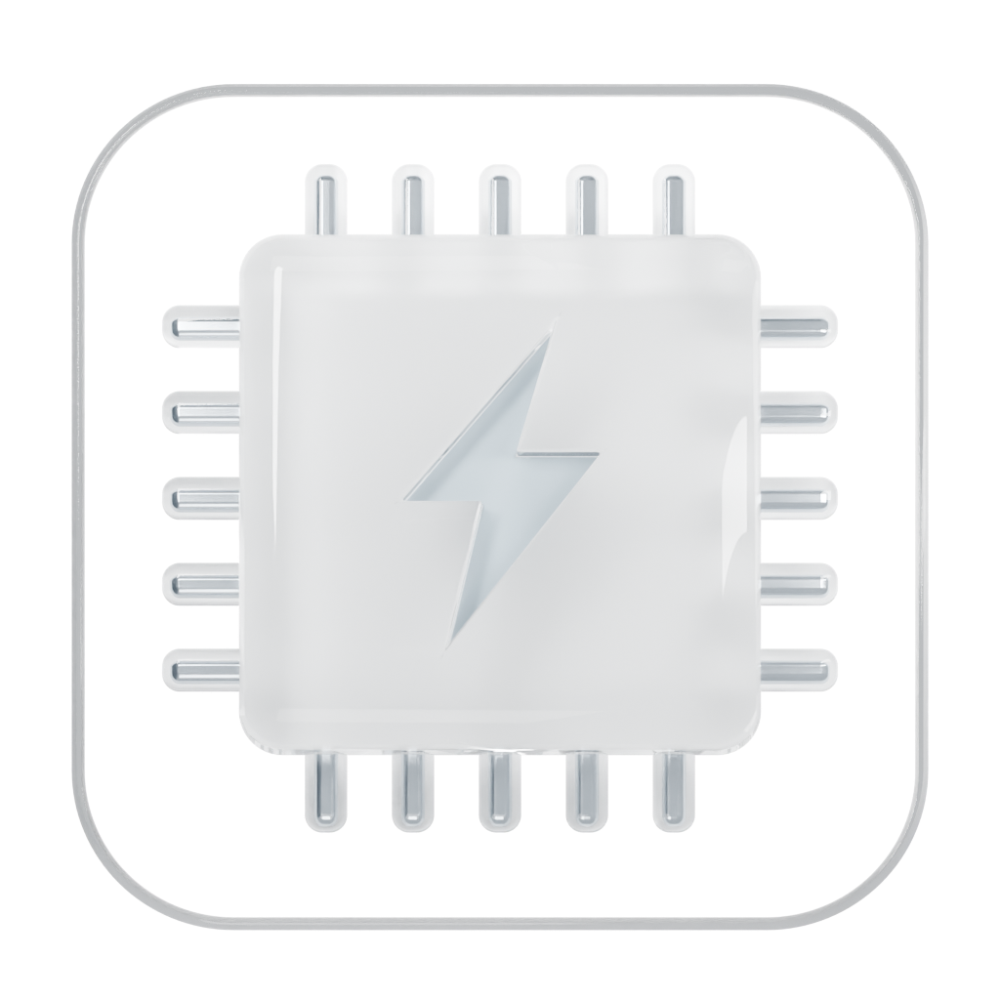

# state 界面展示

state 的界面围绕菜单栏快速查看设计：信息密度可控、隐藏项目不采样、浅色和深色使用同一套布局。功率流保持统一圆角、灰阶和 SF Symbols 图标，流线粗细随功率变化。

## 当前版本截图

截图展示了三大设置区中的模块管理页面、模块启用状态，以及菜单栏中的实时功率分布和充电上限。

## 菜单面板

电池状态、温度、功率、循环次数、能耗应用和充电上限在同一面板中显示；面板高度随可见模块自动适配。

## 功率分布

功率流支持二级和三级显示。电池、适配器、整机芯片、显示器、其他系统和外接设备按当前供电状态显示，未接入的来源不会占用空白卡片。

## state 图标

图标由 Blender 建模并以 Cycles 渲染：实体玻璃 CPU、细玻璃外圈和中央凹刻闪电，背景为纯白。可编辑模型和可复现渲染脚本位于 [`Design/state-icon.blend`](../Design/state-icon.blend) 和 [`Design/state_blender.py`](../Design/state_blender.py)。

## 设置结构

设置固定分为三个大区：

- 通用设置：应用、模块、数据服务、电池状态、功率监控、充电控制和校准。
- 面板设置：布局与预览，以及各模块的显示项目和顺序。
- 功能设置：采样策略、充电策略、温控和校准等行为参数。

模块安装或移除后，对应页面自动注册或消失；预览和实际菜单共用原生渲染组件。
